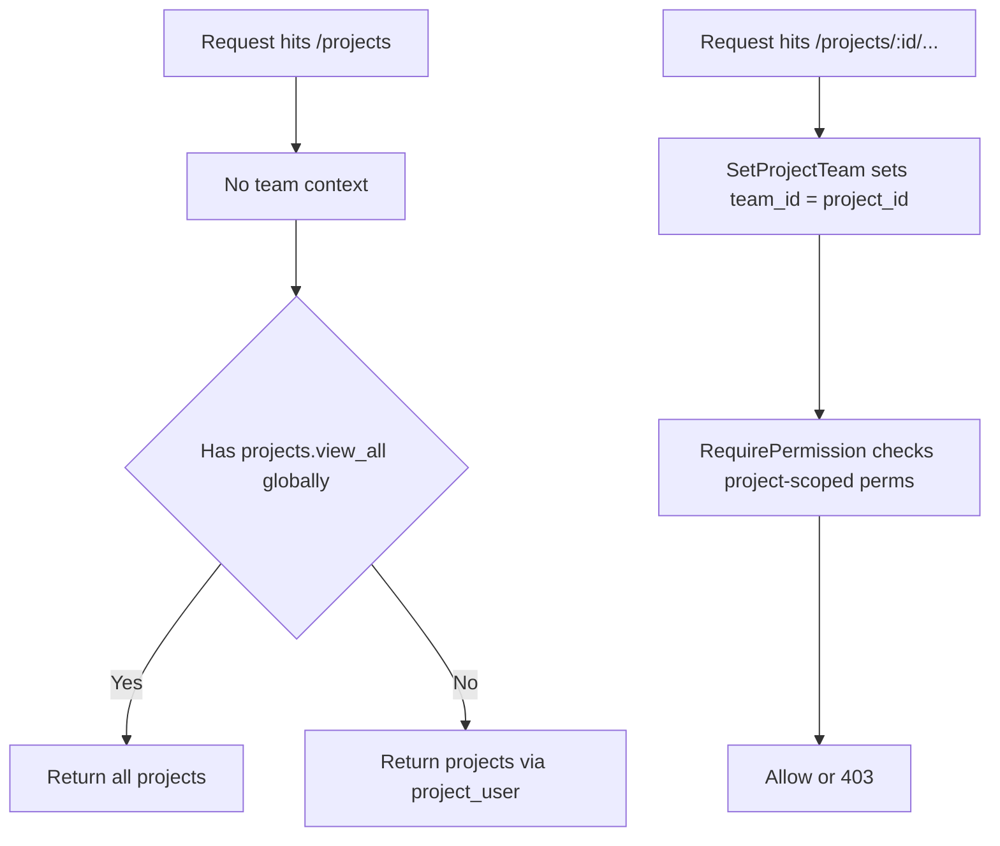
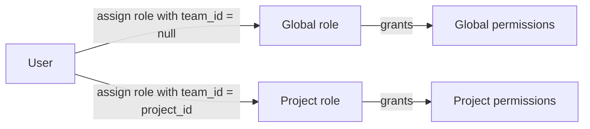

# Project-scoped RBAC design for workers and foremen

Summary
- Use Spatie Permission Teams to separate GLOBAL vs PROJECT-SCOPED capabilities.
- Assign roles per project by storing team_id = project_id; keep global roles at team_id = null.
- Keep global-only powers like viewing all projects out of project roles.
- Allow fine-grained exceptions by assigning a single project-scoped permission instead of a full role.

What exists in this repository
- Teams enabled: [config/permission.php](config/permission.php:134).
- Team context helper: [app/Helpers/PermissionHelper.php](app/Helpers/PermissionHelper.php:5).
- Permission middleware: [app/Http/Middleware/RequirePermission.php](app/Http/Middleware/RequirePermission.php:11).
- Project membership pivot: [Modules/Project/database/migrations/2025_10_18_051916_create_project_user_table.php](Modules/Project/database/migrations/2025_10_18_051916_create_project_user_table.php:11).
- Team columns on Spatie tables: [database/migrations/2025_10_04_080049_add_team_id_to_permission_tables.php](database/migrations/2025_10_04_080049_add_team_id_to_permission_tables.php:1).

Approved vocabulary
- Global permission
  - projects.view_all
- Project-scoped permissions
  - project.view
  - project.attendance.make
  - project.attendance.manage
  - project.tasks.manage
- Roles
  - admin (global only; never inside project teams)
  - foreman (project-scoped; includes attendance permissions; never includes projects.view_all)
  - worker (project-scoped minimal)

Key rules
- Admin is global only. Never attach admin to a project user or assign it with a team_id.
- A person can hold different roles in different projects because each assignment is bound to team_id = that project_id.
- To avoid role leakage, keep global-only permissions out of project roles.
- For one-off needs, grant a direct project-scoped permission rather than a heavier role.

How permission checks resolve
- When there is no project context set (team_id = null), only global roles and permissions apply.
- When a project context is set (team_id = project_id), only roles and permissions assigned with that same team_id apply.
- Therefore, being a foreman in Project C does not automatically grant global powers like projects.view_all.

Setting project context
- Add a middleware SetProjectTeam for routes that operate inside a specific project.
- The middleware should read project_id from the route or model and call [app/Helpers/PermissionHelper.php](app/Helpers/PermissionHelper.php:5) to set team_id.
- After the request completes, the request lifecycle resets context; no extra cleanup is usually needed.

Routing pattern
- For project-internal pages and APIs, group routes under SetProjectTeam followed by RequirePermission.
- For global pages like project index, do not set team; evaluate global permissions only.

Project listing logic
- If user has projects.view_all under global context, return all projects.
- Otherwise, return only projects where the user is attached in [Modules/Project/database/migrations/2025_10_18_051916_create_project_user_table.php](Modules/Project/database/migrations/2025_10_18_051916_create_project_user_table.php:11).

Assignment patterns
- Normal
  - worker role per project as the baseline.
  - foreman role per project when the person should have attendance powers in that project.
- Exception
  - If you only want a specific capability, assign just project.attendance.make to the user in that one project.
- Never put projects.view_all into foreman; if a person truly needs it globally, assign a distinct global role that includes projects.view_all.

Your scenario solved
- The person is a worker in Projects A and B.
- In Project C, they need to make attendance but must not see all projects.
- Solution
  - Option 1: Assign foreman role in Project C only. Because this role is scoped by team_id = C, it only grants project.attendance.make in C and nothing global.
  - Option 2: If you do not want all foreman capabilities in C, grant only project.attendance.make in C without assigning the foreman role.

Admin and dynamic settings
- Block admin from being added to project_user in the UI.
- Provide a backend whitelist of roles that are assignable inside projects: [Modules/Peran/app/Models/Peran.php](Modules/Peran/app/Models/Peran.php:1) can expose a flag, or keep a configuration map in DB.
- Enforce the whitelist in your role-assignment service and UI forms.

Seeding plan
- Create permissions
  - Global: projects.view_all
  - Project-scoped: project.view, project.attendance.make, project.attendance.manage, project.tasks.manage
- Create roles
  - admin with projects.view_all assigned globally (team_id = null)
  - foreman with project.attendance.make (+ optional manage, tasks) assigned per project (team_id = project_id)
  - worker minimal per project
- Assignments
  - Never assign admin at a team_id.
  - Assign foreman and worker with the current team context set by [app/Helpers/PermissionHelper.php](app/Helpers/PermissionHelper.php:5).

Mermaid: request flow

Mermaid: assignment model

Operational checklist
- Create SetProjectTeam middleware and attach it before RequirePermission on project routes.
- Ensure global pages run without setting team context.
- Update project index to branch by projects.view_all vs project_user membership.
- Seed permissions and roles as above; keep global-only powers out of project roles.
- In UI, allow admins to configure which roles are assignable inside projects; exclude admin.

Notes
- Because the Spatie Teams resolver is already wired in [config/permission.php](config/permission.php:139), the setTeamId call will scope checks and assignments.
- Keep permission names stable; evolving feature flags should map to new permissions rather than overloading existing ones.

This design allows a worker to be a foreman in Project C strictly for attendance while keeping their global visibility unchanged.
---

## Differentiating global vs project-scoped roles, and naming recommendations

Short answer
- You don’t differentiate by role name; you differentiate by where the role is assigned:
  - Global assignment: team_id = null (no project context).
  - Project-scoped assignment: team_id = project_id.
- Spatie Teams is already enabled in [config/permission.php](config/permission.php:134). Your request/route context should set the team via [PHP.setTeamId()](app/Helpers/PermissionHelper.php:5), and permission checks run through [PHP.RequirePermission::handle()](app/Http/Middleware/RequirePermission.php:11).

How to think about scope
- One “foreman” role definition (template) is enough. Scope is determined at assignment time:
  - Assign “foreman” with team_id = 42 → foreman for Project 42 only.
  - Assign a role with team_id = null → that role is global for the user.
- Only create a separate global role when its capabilities are fundamentally different from the project-scoped template. If you ever need “Foreman with global visibility,” define a distinct role (e.g., foreman_global) and keep its permissions global-only (e.g., include projects.view_all but not project-scoped powers).

Optional metadata (to guide UI and avoid mistakes)
- Add flags on the role model to enforce usage in your UI:
  - is_global_only: prevents assigning that role to a project/team.
  - is_project_assignable: allows the role to appear in per-project assignment lists.
- Even without schema changes, you can enforce this via a server-side whitelist in your role-assignment service.

Naming conventions: good vs better
- Scope should NOT be encoded in the permission name. Scope comes from context (team_id). Keep names stable and meaningful.
- Recommended set (approved earlier):
  - Global: projects.view_all
  - Project-scoped:
    - project.view
    - project.attendance.create (better verb than “make”)
    - project.attendance.manage
    - project.tasks.manage
- Patterns that scale:
  - Use singular “project.” prefix for per-project actions and plural “projects.” prefix for global collection actions.
  - Prefer standard verbs: view, list, create, update, delete, manage.
  - Use snake_case consistently.

Examples that answer “how do I tell them apart?”
- Same role name, different scope:
  - “foreman” assigned with team_id = null → global foreman (avoid unless you intend it).
  - “foreman” assigned with team_id = 100 → foreman in Project 100 only.
- Same permission name, different scope:
  - “project.attendance.create” assigned with team_id = 100 → can create attendance in Project 100 only.
  - “projects.view_all” assigned with team_id = null → can list all projects globally.

Operational guardrails
- Ensure your project routes set the current team before permission checks using [PHP.setTeamId()](app/Helpers/PermissionHelper.php:5), ordered before [PHP.RequirePermission::handle()](app/Http/Middleware/RequirePermission.php:11).
- Keep global pages (like project index) outside of team context; evaluate global permissions only.
- Do not include projects.view_all inside the “foreman” template. If someone needs that, grant a separate global role.

Answer to “does naming good?”
- Your current intent is good. For clarity and industry consistency, prefer:
  - “attendance.create” over “attendance.make”
  - Keep “projects.view_all” for the global list capability
  - Keep “project.” prefix for project-scoped actions, “projects.” for global collection actions

This way, you never need to invent new role names just to signal scope. The assignment context (team_id) and route context (SetProjectTeam) make the scope explicit and safe.
---

## Q&amp;A: differentiating global vs project-scoped roles, and naming

Q1: How do I differentiate global and project-scoped roles?
- Do not differentiate by role name. Differentiate by where the role is assigned:
  - Global role assignment: team_id = null, i.e., no project context.
  - Project-scoped role assignment: team_id = project_id.
- Route/request context sets scope for permission checks:
  - Teams already enabled in [config/permission.php](config/permission.php:134). 
  - Set the current team (project) per request using [PHP.setTeamId()](app/Helpers/PermissionHelper.php:5) before permission checks run via [PHP.RequirePermission::handle](app/Http/Middleware/RequirePermission.php:11).
  - Global pages (e.g., list all projects) should NOT set team; they evaluate only global permissions such as projects.view_all.
- Practical outcome:
  - One “foreman” role definition is enough; assignment determines scope. 
  - A person can be foreman in Project C (team_id = C) without gaining global powers.
  - Admin lives only at global scope; never assign it with a team_id or via project membership.

Q2: Is the naming good?
- Yes, with small improvements for clarity and scalability:
  - Keep scope out of the name. Scope is determined by context (team_id), not by renaming roles/permissions.
  - Use consistent prefixes:
    - Global collection actions: projects.*
    - Project-scoped actions: project.*
  - Prefer standard verbs:
    - Use view, list, create, update, delete, manage
    - Prefer attendance.create over attendance.make
- Examples
  - Good (global): projects.view_all
  - Good (project-scoped): project.view, project.attendance.create, project.attendance.manage, project.tasks.manage
  - Avoid: foreman_global, project42_foreman, project.attendance.make (nonstandard verb), encoding scope in the name

If you keep assignment context and route context aligned (Teams + [PHP.setTeamId()](app/Helpers/PermissionHelper.php:5) before [PHP.RequirePermission::handle](app/Http/Middleware/RequirePermission.php:11)), the same role and permission names cleanly support both global and project-scoped behavior without renaming.